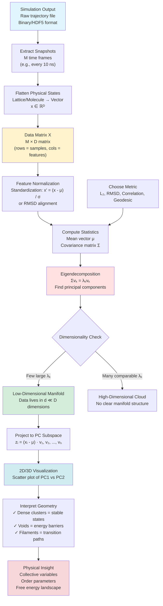

# **Chapter 1: From Simulation to Data**

---

# **Introduction**

Volume II established the forward problem: given physical laws and initial conditions, simulate the system's evolution to generate trajectories, ensembles, and observables. We built integrators for Newton's equations, Monte Carlo samplers for thermal equilibria, and finite-difference solvers for partial differential equations. The output of these efforts is invariably a massive corpus of raw information—terabytes of particle coordinates $\mathbf{r}_i(t)$, arrays of spin configurations $\{s_i\}^{(t)}$, or time-evolving field values $\phi(\mathbf{x},t)$. Once the simulation terminates, the dynamical engine falls silent, and we are left with a static artifact: the **dataset**.

The transition from simulation to data analysis requires a fundamental conceptual shift. In Volume II, we thought in terms of **dynamics**: how does state $\mathbf{s}_t$ causally produce state $\mathbf{s}_{t+1}$? In Volume III, we must think in terms of **geometry**: how is the entire ensemble of states $\{\mathbf{s}_i\}$ arranged in high-dimensional space? This chapter establishes the mathematical and computational foundations for this transition, introducing the core concepts that transform raw simulation outputs into structured datasets amenable to statistical analysis and machine learning.

We begin by reconceptualizing simulation outputs as clouds of points in high-dimensional **feature space** $\mathbb{R}^D$, where each snapshot becomes a single data vector. We introduce the **manifold hypothesis**—the observation that while data may formally live in a space with millions of dimensions, physical constraints confine it to a much lower-dimensional surface embedded within that space. This geometric perspective leads naturally to the **covariance matrix** and **principal component analysis (PCA)**, tools that reveal the data's intrinsic axes of variation and allow us to visualize high-dimensional clouds as interpretable 2D maps. We then examine how different **distance metrics** (Euclidean, correlation, geodesic) encode different notions of similarity, and how the topology of the data cloud directly reflects the underlying energy landscape. Finally, we demonstrate these concepts through a worked example analyzing molecular dynamics trajectories, showing how covariance analysis automatically discovers collective variables and metastable states.

By the end of this chapter, you will understand how to convert simulation trajectories into structured data matrices, compute and interpret principal components as physical order parameters, choose appropriate distance metrics for different physical systems, and recognize that the shape of a data cloud is a geometric encoding of the free-energy landscape. These foundations prepare you for Chapter 2, where we develop the probabilistic framework needed to estimate continuous distributions from finite samples and confront the counterintuitive phenomena that emerge in high-dimensional spaces.

---

# **Chapter 1: Outline**

| **Sec.** | **Title** | **Core Ideas & Examples** |
|:---------|:----------|:--------------------------|
| **1.1** | **Data as the New State Variable** | Transition from dynamics to geometry; phase space vs. feature space $\mathbb{R}^D$; simulation snapshots as independent samples; manifold hypothesis: high-dimensional data confined to low-dimensional surfaces; order parameters as principal axes; example: Ising lattice $2^{256}$ states → 1D manifold (magnetization $M$). |
| **1.2** | **Representing Simulation Outputs** | Flattening physical states (lattice → vector, molecule → concatenated coordinates); feature scaling and standardization $x' = (x - \mu)/\sigma$; time averages vs. ensemble averages; ergodic hypothesis; empirical distribution $X$ as estimate of $P(\mathbf{x})$; mean vector $\mathbf{\mu}$ and covariance matrix $\Sigma$ as fundamental descriptors. |
| **1.3** | **The Geometry of Variability** | Covariance as geometric operator; eigendecomposition $\Sigma \mathbf{v}_k = \lambda_k \mathbf{v}_k$; principal components as axes of max variance; manifold discovery via eigenvalue spectrum; collective variables in molecular dynamics; visualization via 2D PC projection; protein hinging motion as PC1; Ising magnetization as automatic order parameter. |
| **1.4** | **Distance, Similarity, and Metrics** | Euclidean $L^2$ norm limitations; RMSD for rotationally invariant molecular comparison; correlation distance for pattern similarity; geodesic distance on manifolds vs. straight-line Euclidean; Swiss Alps analogy; energy barriers invisible to $L^2$; foundation for nonlinear dimensionality reduction (t-SNE, UMAP). |
| **1.5** | **From Clouds to Structure** | Data cloud topology encodes energy landscape; dense clusters = metastable basins; voids = energy barriers; filaments = transition paths; Shannon entropy $S = -k_B \sum p_i \ln p_i$ as data spread measure; low entropy (ordered, low-$T$) vs. high entropy (disordered, high-$T$); clustering algorithms as phase identification. |
| **1.6** | **Worked Example — Molecular Trajectories** | Protein MD simulation (lysozyme, $N \approx 20{,}000$ atoms, $M = 100{,}000$ snapshots); flattening to $\mathbb{R}^{60000}$; covariance of atomic displacements; eigendecomposition reveals 10–50 dominant modes; PC1 = collective hinging motion; 2D projection shows two metastable conformations (open/closed); sparse filaments = transition pathways. |
| **1.7** | **Code Demo — Visualizing the Data Geometry** | Python implementation: generate synthetic 5D correlated data; sklearn PCA to find principal components; 2D scatter plot reveals elongated ellipse aligned with engineered correlation; variance ratio confirms PC1 dominance; demonstrates manifold discovery from correlation structure. |
| **1.8** | **Takeaways & Bridge to Chapter 2** | Recap: simulation → data cloud, covariance → geometry, PCA → collective variables, topology → energy landscape. **Bridge to Ch. 2**: From geometric description (mean, covariance) to full probability distribution $P(\mathbf{x})$; estimating continuous densities from finite samples; curse of dimensionality; entropy and likelihood; maximum entropy principle. |

---

## **1.1 Data as the New State Variable**

---

### **The Post-Simulation Reality**

In Volume II, we focused on the *generative* side of computational physics: building integrators, construct Monte Carlo samplers, and solving partial differential equations. The output of these efforts is typically a massive stream of raw information—terabytes of particle trajectories $\mathbf{r}_i(t)$, traces of spin configurations $\{s_i\}^{(t)}$, or time-evolving fields $\phi(\mathbf{x},t)$.

Once the simulation finishes, however, the dynamical "engine" turns off. We are left with a static artifact: the **dataset**. In classical theoretical physics, this might be a mere intermediate step before computing a single macroscopic observable like average magnetization $\langle M \rangle$. In the modern era, the dataset itself is the object of study.

The transition from *simulation* to *data analysis* requires a fundamental shift in perspective. We must move from thinking about **dynamics** (how state $\mathbf{s}_t$ causes state $\mathbf{s}_{t+1}$) to thinking about **geometry** (how the set of all states $\{\mathbf{s}_i\}$ is arranged in high-dimensional space).

!!! tip "The Paradigm Shift: Dynamics to Geometry"
```
In Volume II, we asked: "Given initial conditions and laws, what happens next?" This is the forward problem of simulation. In Volume III, we ask: "Given a cloud of observed states, what are the underlying laws?" This is the inverse problem of inference. The bridge is geometry: the shape of the data cloud encodes both the dynamics that created it and the probability distribution that governs it.

```
---

### **Phase Space vs. Feature Space**

In physics, we are accustomed to **phase space**, $\Gamma$. For a classical system of $N$ particles, this is a $6N$-dimensional space where every point represents a complete microscopic description of the system:

$$
(\mathbf{r}_1, \dots, \mathbf{r}_N, \mathbf{p}_1, \dots, \mathbf{p}_N)
$$

A simulation traces a curve through this space, governed by a Hamiltonian $\mathcal{H}$.

In data science, we introduce a parallel concept: **feature space** (often denoted $\mathbb{R}^D$). A "sample" in data science is analogous to a "microstate" in statistical mechanics.
* **In Simulation:** A state is a snapshot in time, causally linked to the previous moment.
* **In Data Science:** A state is a point in a high-dimensional vector space, statistically related to other points in the ensemble.

Consider a molecular dynamics simulation of a protein. Physically, it is a continuous trajectory. Viewed as a dataset, it is a cloud of $10^6$ points in $\mathbb{R}^{3N}$. The task of Volume III is to learn the shape of this cloud. Does it form a unified blob (a single stable folded state)? Does it have two distinct clusters separated by a void (metastable states with a transition barrier)?

By treating simulation outputs as data, we convert physical questions into geometric ones. "Entropy" becomes a measure of data spread; "phase transitions" become changes in the topology of the data manifold; "order parameters" become principal axes of variation.

---

### **The Manifold Hypothesis**

A crucial realization in modern data analysis is that while data may live in a profoundly high-dimensional space $D$ (where $D$ might be $10^{6}$ pixels in an image or $10^{23}$ atoms in a solid), it almost never occupies that space uniformly.

Physical systems are constrained. Conservation laws, energetic symmetries, and correlations mean that the accessible states lie on a much lower-dimensional surface embedded within the larger space.

> **The Manifold Hypothesis:** Real-world high-dimensional data lie on or near a low-dimensional manifold $\mathcal{M}$ embedded in observation space $\mathbb{R}^D$.

In computational physics, this is almost tautological. A gas of $N$ particles has $3N$ coordinates, but if it is confined to a 2D surface and has fixed total energy, its true degrees of freedom are far fewer than $3N$. The "manifold" is simply the surface of constant energy in phase space.

Machine learning algorithms (like PCA, t-SNE, or autoencoders) are essentially tools for **manifold discovery**. They attempt to find the coordinate system of $\mathcal{M}$ rather than $\mathbb{R}^D$. For a physicist, discovering this manifold is equivalent to discovering the *collective variables* or *generalized coordinates* that genuinely describe the system's macroscopic behavior.

!!! example "Ising Model on a 16×16 Lattice"
```
Each spin configuration is a point in $\mathbb{R}^{256}$ (after flattening). But at temperature $T < T_c$, the system explores only two regions: states with mostly +1 spins (magnetization $M \approx +1$) and mostly -1 spins ($M \approx -1$). The data manifold is effectively **1-dimensional** (parameterized by total magnetization $M$), not 256-dimensional. PCA automatically discovers this: PC1 is $\mathbf{v}_1 = (1,1,1,\ldots,1)$, the sum of all spins.

```
!!! tip "Conceptual Bridge from Dynamics to Geometry"
```
Simulation turns physical laws into data; analysis turns data back into physical insight. The first step in this conceptual flip is to stop seeing a trajectory as a movie, and start seeing it as a static geometry in high-dimensional space.

```
---

## **1.2 Representing Simulation Outputs**

The raw output of a simulation (e.g., a binary trajectory file) is not a dataset. A dataset, in the language of data science, is a structured table—a matrix $X$ of size $M \times D$, where $M$ is the number of samples (snapshots) and $D$ is the number of features (variables). This section covers the practical and conceptual steps of transforming physical configurations into this standard matrix representation [1,2].

---

### **Flattening Physical States**

Most machine learning algorithms are "geometrically unaware." They do not intrinsically understand that a $16 \times 16$ lattice has a 2D topology, or that a list of 100 atomic coordinates describes a 3D object. They expect input as a simple, one-dimensional vector, $\mathbf{x} \in \mathbb{R}^D$. This conversion process is known as **flattening**.

* **Lattice Models:** A $16 \times 16$ spin configuration (a 2D matrix) is "unrolled" into a $D=256$ dimensional vector:

$$
\mathbf{x} = (s_{1,1}, s_{1,2}, \dots, s_{1,16}, s_{2,1}, \dots, s_{16,16})
$$

* **Molecular Dynamics:** A system of $N$ particles, each with 3 coordinates, is concatenated into a single $D=3N$ dimensional vector:

$$
\mathbf{x} = (r_{1,x}, r_{1,y}, r_{1,z}, r_{2,x}, r_{2,y}, r_{2,z}, \dots, r_{N,z})
$$

This flattening is a brute-force operation. It discards explicit topological information (like neighborhood proximity in the lattice) and rotational/translational symmetries (in the molecule). A key task of modern machine learning (e.g., graph neural networks, Ch. 18) is to build architectures that do *not* require this step, but for classical analysis, it is the necessary starting point. The collection of $M$ such flattened snapshots forms the **data matrix $X$**.

---

### **Feature Scaling and Normalization**

Once flattened, the features (columns of $X$) often have wildly different physical units and scales. A molecular dynamics vector might concatenate atomic positions (in Ångströms, $\sim 10^{-10}$) with the simulation box length (in nanometers, $\sim 10^{-8}$). If left uncorrected, the box length would numerically dominate any geometric analysis, rendering the atomic positions irrelevant.

We must **normalize** the data to place all features on an equal footing. The most common method is **standardization (or Z-score normalization)**, which centers each feature at zero mean and scales it to unit variance.

For each feature $j$ (column) in the data matrix $X$:

1. Compute the feature mean:

$$
\mu_j = \frac{1}{M} \sum_{i=1}^M x_{ij}
$$

2. Compute the feature standard deviation:

$$
\sigma_j = \sqrt{\frac{1}{M-1} \sum_{i=1}^M (x_{ij} - \mu_j)^2}
$$

3. Rescale the feature:

$$
x'_{ij} = \frac{x_{ij} - \mu_j}{\sigma_j}
$$

This standardized matrix $X'$ now describes the *relative* variations and correlations within the data, which is the foundation for all subsequent geometric and statistical analysis [1].

---

### **Time Averages vs. Ensemble Averages**

In physics, we distinguish two types of averages. A **time average** is an average over a single, long trajectory, as defined by the **Ergodic Hypothesis** [2].

$$
\langle A \rangle_{\text{time}} = \lim_{T\to\infty} \frac{1}{T} \int_0^T A(\mathbf{s}(t)) dt
$$

This is what a single simulation run produces.

An **ensemble average** is a conceptual average over an infinite number of independent system copies, each drawn from the equilibrium probability distribution $P(\mathbf{s})$.

$$
\langle A \rangle_{\text{ens}} = \int A(\mathbf{s}) P(\mathbf{s}) d\mathbf{s}
$$
When we treat our $M$ simulation snapshots as a dataset, we are implicitly shifting from the time-average picture to the ensemble-average picture. We assume each snapshot $\mathbf{x}_i$ is an independent sample drawn from an underlying (and unknown) distribution $P(\mathbf{x})$.

Our dataset $X$ is therefore an **empirical distribution**—our best estimate of the true, unknown $P(\mathbf{x})$. The goal of data analysis is to infer the properties of $P(\mathbf{x})$ from $X$.

---

### **The Fundamental Statistical Descriptors**

The simplest properties we can extract from our empirical distribution are its first and second moments: the **mean vector** and the **covariance matrix**.

* **Mean Vector ($\mathbf{\mu}$):** The average state, or the center of the data cloud.

$$
\mathbf{\mu} = \frac{1}{M}\sum_{i=1}^M \mathbf{x}_i
$$

* **Covariance Matrix ($\Sigma$):** A $D \times D$ matrix describing the shape, spread, and orientation of the data cloud.

$$
\Sigma = \frac{1}{M-1}\sum_{i=1}^M (\mathbf{x}_i - \mathbf{\mu})(\mathbf{x}_i - \mathbf{\mu})^{\top}
$$

The mean vector $\mathbf{\mu}$ tells us the average configuration (e.g., the mean positions of all atoms). The covariance matrix $\Sigma$ is far more powerful: its diagonal elements $\Sigma_{jj}$ are the *variances* of each feature, while its off-diagonal elements $\Sigma_{jk}$ reveal the *linear correlation* between features $j$ and $k$.

This matrix, $\Sigma$, is the bridge from simple data representation to geometric analysis. As we will see in the next section, it encodes the principal axes of variation and is the key to discovering the data's intrinsic geometry.

---

## **1.3 The Geometry of Variability**

The mean vector $\mathbf{\mu}$ locates the *center* of our data cloud, but the covariance matrix $\Sigma$ describes its *shape*. In this section, we transition from viewing $\Sigma$ as a mere statistical summary to understanding it as a **geometric operator** that defines the intrinsic axes of variation within our data [1,8].

---

### **Covariance as a Geometric Operator**

The covariance matrix $\Sigma$ is, by construction, a $D \times D$ symmetric and positive semi-definite matrix. From linear algebra, this guarantees that $\Sigma$ has a full set of $D$ real, non-negative eigenvalues $\lambda_k$ and a corresponding set of $D$ orthogonal eigenvectors $\mathbf{v}_k$. They are related by the eigenvalue equation:

$$
\Sigma \mathbf{v}_k = \lambda_k \mathbf{v}_k
$$

This equation is not just a mathematical curiosity; it is the key to understanding the data's geometry.

* **Eigenvectors ($\mathbf{v}_k$):** These are the **principal axes** of the data cloud. They form a new, orthogonal coordinate system that is aligned with the data's natural orientation. The first principal component, $\mathbf{v}_1$ (corresponding to the largest eigenvalue $\lambda_1$), is the single vector direction along which the data varies the most. The second, $\mathbf{v}_2$, is the orthogonal direction that captures the most *remaining* variance, and so on.
* **Eigenvalues ($\lambda_k$):** Each eigenvalue $\lambda_k$ is precisely the *variance* of the data when projected onto its corresponding eigenvector $\mathbf{v}_k$.

This decomposition of $\Sigma$ is the mathematical core of **Principal Component Analysis (PCA)**, a foundational technique for dimensionality reduction [1,8].

---

### **Manifold Intuition and Collective Variables**

In most physical systems, $D$ is enormous (e.g., $3N \sim 10^5$ for a protein), but the *effective* degrees of freedom are small. A protein doesn't randomly explore all $10^5$ dimensions; it folds, hinges, and twists in a highly coordinated fashion.

This physical constraint appears directly in the eigenvalue spectrum $\{\lambda_k\}$ of the covariance matrix. We will almost always find that:
* A few eigenvalues ($\lambda_1, \dots, \lambda_d$ where $d \ll D$) are large.
* The vast majority of the $D-d$ remaining eigenvalues are very small, often near zero.

This tells us the data cloud is not a $D$-dimensional "hyper-sphere." It is a "hyper-pancake" or "cigar"—a structure that is geometrically flat in most directions. The subspace spanned by the first $d$ principal components ($\mathbf{v}_1, \dots, \mathbf{v}_d$) forms a linear approximation of the low-dimensional manifold $\mathcal{M}$ on which the data truly lives.

For a physicist, these principal components are the system's **collective variables** or **order parameters**, discovered automatically from the data.

* **Analogy 1: Molecular Dynamics.** In a simulation of a protein, PC1 is rarely "atom 5 moves left." Instead, it is a complex vector describing a collective motion, such as the "hinging" of two domains—a physical *normal mode* of the system [3,4].
* **Analogy 2: Spin Systems.** In a simulation of the Ising model, PC1 (the direction of max variance) corresponds to the total magnetization:

$$
M = \sum_i s_i
$$

The analysis has automatically identified the system's order parameter.

---

### **Visualization: Projecting the Shadow**

We cannot visualize our data in $\mathbb{R}^D$, but we *can* visualize its projection onto the most important subspace. The most common visualization in data-driven physics is a 2D scatter plot of the data projected onto its first two principal components.

For each high-dimensional snapshot $\mathbf{x}_i$, we compute its 2D coordinates:

$$
z_{i1} = (\mathbf{x}_i - \mathbf{\mu}) \cdot \mathbf{v}_1
$$

(Coordinate along PC1)

$$
z_{i2} = (\mathbf{x}_i - \mathbf{\mu}) \cdot \mathbf{v}_2
$$

(Coordinate along PC2)

Plotting $z_{i2}$ versus $z_{i1}$ for all $M$ samples reveals the "shadow" of the manifold. This 2D map is our primary tool for visual exploration, allowing us to see the shape of the data: Are there distinct clusters (phases)? Are there clear pathways (transition states)? We have turned a terabyte simulation file into a single, interpretable map.

---

## **1.4 Distance, Similarity, and Metrics**

Projecting data onto its principal components reveals the linear *geometry* of the data cloud (Section 1.3). However, this geometry is entirely dependent on our definition of "distance." The covariance matrix $\Sigma$ is built upon the implicit assumption of a standard **Euclidean (or $L^2$) metric**. In high-dimensional physical systems, this default assumption can be misleading, and choosing a metric that reflects the underlying physics is a critical modeling decision [5,6].

---

### **The $L^2$ Norm and its Limitations**

The Euclidean distance between two flattened state vectors $\mathbf{x}_i$ and $\mathbf{x}_j$ is the familiar $L^2$ norm:
$$
d_E(\mathbf{x}_i, \mathbf{x}_j) = \|\mathbf{x}_i - \mathbf{x}_j\|_2 = \sqrt{\sum_{k=1}^D (x_{ik} - x_{jk})^2}
$$
This metric is the default for PCA and many clustering algorithms (like K-means). However, it has a significant drawback: it treats all $D$ features as independent and equally important. After flattening a 3D molecular structure into a $3N$-dimensional vector, the $L^2$ norm loses all information about the original 3D rotational and translational symmetries. Two molecular configurations that are identical (one is just rotated) will have a large Euclidean distance, a physically nonsensical result.

This necessitates metrics that are **invariant** to the underlying physical symmetries. A classic example is **Root Mean Square Deviation (RMSD)**, widely used in biophysics. RMSD first optimally aligns (superimposes) two structures to remove translational and rotational differences *before* computing the Euclidean distance of the atoms [5]. This is a *physically-aware* metric.

---

### **Correlation Distance**

In many systems, we are interested in the *shape* of a signal, not its *magnitude*. For example, two time-series signals (like the magnetization trace $M(t)$ from two different simulation runs) might show the same fluctuations but have different baseline offsets or amplitudes. The Euclidean distance between them would be large, but a physicist would call them highly correlated.

We can define a distance based on the **Pearson correlation coefficient**, $r$:
$$
r_{ij} = \frac{(\mathbf{x}_i - \mathbf{\mu}_i) \cdot (\mathbf{x}_j - \mathbf{\mu}_j)}{\|\mathbf{x}_i - \mathbf{\mu}_i\| \|\mathbf{x}_j - \mathbf{\mu}_j\|}
$$
where $\mathbf{\mu}_i$ and $\mathbf{\mu}_j$ are the means of vectors $\mathbf{x}_i$ and $\mathbf{x}_j$. The correlation coefficient $r_{ij}$ ranges from +1 (perfectly correlated) to -1 (perfectly anti-correlated).

A common **correlation distance** is then defined as:
$$
d_C(\mathbf{x}_i, \mathbf{x}_j) = \sqrt{2(1 - r_{ij})}
$$
This metric is 0 for perfectly correlated signals ($r=1$) and reaches its maximum of 2 for perfectly anti-correlated signals ($r=-1$). It is a powerful tool for finding *functionally* similar states, even if their raw values are different.

??? question "When Should You Use Correlation Distance vs. Euclidean Distance?"
```
Use **Euclidean distance** when absolute differences matter (e.g., comparing atomic positions where 1 Å displacement is physically meaningful). Use **correlation distance** when you care about patterns or shapes regardless of scale (e.g., comparing time-series signals where the trend matters more than the amplitude, or comparing molecular conformations where you want rotational/translational invariance). Correlation distance is essentially asking: "Do these two states vary together?" rather than "Are these two states numerically close?"

```
---

### **Manifold Distance (Geodesic Distance)**

---

### **Manifold Distance (Geodesic Distance)**

The most profound limitation of the $L^2$ norm is that it measures distance "as the crow flies"—straight through the high-dimensional embedding space $\mathbb{R}^D$. But if the data lives on a curved manifold $\mathcal{M}$ (Section 1.1.2), the physically relevant distance is the **geodesic distance**: the shortest path between two points *while staying on the manifold*.

!!! example "The Swiss Alps Analogy"
```
The Euclidean distance between two villages on opposite sides of a mountain may be 1 km. But the *geodesic* (hiking) distance, which must go up and over the mountain, might be 10 km. Euclidean distance fails to see the mountain—it measures straight through the obstacle rather than the actual traversable path.

```
Euclidean distance fails to see the mountain. A simulation trajectory from one metastable state to another (e.g., protein folding) traces a long path *on the manifold*. The $L^2$ distance between the start and end states is short, completely missing the massive energy barrier (the "mountain") between them.

The geodesic distance $d_G(\mathbf{x}_i, \mathbf{x}_j)$ is the true measure of dissimilarity within the system's constrained state space. While difficult to compute directly, it is the conceptual foundation for all **nonlinear dimensionality reduction** techniques (like t-SNE and UMAP, discussed in Chapter 3), which are designed to "unroll" the manifold $\mathcal{M}$ into a flat space while preserving these local geodesic distances [6,9].

---

## **1.5 From Clouds to Structure**

The previous sections established how to represent a simulation as a **data cloud**—a collection of $M$ points in a $D$-dimensional feature space $\mathbb{R}^D$—and how to choose a metric to measure distances within it. Now, we ask the central question: *What does the shape of this cloud tell us about the physics?*

---

### **The Cloud's Shape is the Energy Landscape**

A simulation is not a uniform sampler of $\mathbb{R}^D$. A physical system governed by a potential energy function $E(\mathbf{x})$ preferentially visits low-energy states. According to the Boltzmann distribution, the probability of observing a state $\mathbf{x}$ is [2]:
$$
P(\mathbf{x}) \propto e^{-E(\mathbf{x})/k_B T}
$$
This fundamental law of statistical mechanics (Pathria & Beale, 2011) has a profound geometric consequence:
* **Dense Clusters $\leftrightarrow$ Metastable States:** Regions in the data cloud with a high density of points correspond to **basins** in the potential energy landscape. These are the system's stable or metastable states (e.g., folded, unfolded, or misfolded protein conformations; liquid or solid phases).
* **Empty Voids $\leftrightarrow$ Energy Barriers:** Large empty regions in the data cloud correspond to high-energy barriers. The system *can* cross these regions, but does so rarely, making such states exponentially unlikely to be sampled.
* **Filaments & Pathways $\leftrightarrow$ Transition States:** The sparse "filaments" of points that occasionally connect two dense clusters are the system's **transition paths**. These are trajectories that successfully cross the energy barriers, passing through or near the saddle points of the potential energy surface.

Therefore, by analyzing the *topological structure* of the data cloud, we are performing a data-driven version of **free-energy landscape mapping**. A data-clustering algorithm (Chapter 3) is, in this context, an algorithm for automatically identifying the system's metastable phases.

---

### **Linking Geometry to Information: Entropy**

We can formalize the "spread" of the data cloud using the language of information theory. If we discretize the state space into microstates (or bins) $i$, our data cloud $X$ gives an empirical probability $p_i$ for each bin (the fraction of samples in that bin).

The **Shannon entropy** of this distribution is [7]:
$$
S = -k_B \sum_i p_i \ln p_i
$$
(We include $k_B$, Boltzmann's constant, to make the connection to thermodynamics explicit).

This single number provides a direct link between geometry and physics:
* **Low Entropy:** If the data cloud is highly concentrated in one small region (one deep energy well), $p_i \approx 1$ for a single state and $S \approx 0$. This is a **low-temperature, ordered** state.
* **High Entropy:** If the data cloud is spread diffusely over many states (a flat, high-energy landscape), $p_i$ is small and uniform, and $S$ is large. This is a **high-temperature, disordered** state.

In this view, data analysis is the process of inferring the *information geometry* of the system. The covariance matrix (Section 1.3) captures the Gaussian, or lowest-order, approximation of this geometry. The full cluster structure (Chapter 3) and nonlinear embeddings (Chapter 3) will provide a richer, higher-order picture of this fundamental probability/energy landscape.

---

## **1.6 Worked Example — Molecular Trajectories**

Let us now apply these concepts to a canonical problem in computational physics: analyzing a **molecular dynamics (MD) trajectory**.

**1. The System and Simulation:**

Consider a 1-microsecond simulation of a protein, such as the enzyme lysozyme, in a box of water. The simulation engine saves the (x, y, z) coordinates of all $N$ atoms ($N \approx 20,000$) every 10 nanoseconds.

* **Raw Output:** A trajectory file.
* **Samples (M):** $100,000$ snapshots (frames).
* **Raw Features (D):** $3N \approx 60,000$ coordinates.

**2. Data Preparation (Flattening & Centering):**

As described in Section 1.2, we first "flatten" each snapshot into a single vector $\mathbf{x}_i \in \mathbb{R}^{3N}$. We then compute the mean vector $\mathbf{\mu}$ (the average atomic positions over the entire trajectory) and subtract it, yielding a new data matrix $X'$ of *displacements* from the mean. This centering step ensures our analysis focuses on the *fluctuations* around the average structure, not the static position of the protein in the box.

**3. Analysis I: Covariance and Principal Components:**

We compute the $3N \times 3N$ **covariance matrix of atomic displacements**:
$$
\Sigma = \frac{1}{M-1} \sum_{i=1}^M (\mathbf{x}_i - \mathbf{\mu})(\mathbf{x}_i - \mathbf{\mu})^{\top}
$$
As $3N$ is enormous, this matrix is rarely constructed directly; instead, specialized algorithms are used to find its dominant eigenvectors (Section 1.3) [3].

**4. Interpretation (The Physics):**

We perform an eigendecomposition of $\Sigma$.
* **The Eigenvectors (PCs):** The first eigenvector $\mathbf{v}_1$ is a $3N$-dimensional vector that represents the single, most dominant collective motion of the protein. When animated, this vector might show a large-scale "hinging" motion of the enzyme's active site. The second eigenvector $\mathbf{v}_2$ will show the next most significant motion, orthogonal to the first.
* **The Eigenvalues (Variance):** We invariably find that the first 10-50 eigenvalues are significantly larger than the other $\approx 59,950$, which are near zero. This confirms the **manifold hypothesis** (Section 1.1): the protein's complex motion is constrained to a low-dimensional manifold, governed by a few collective "normal modes."
* **The Visualization:** We project all $100,000$ snapshots onto the first two PCs (as in Section 1.3). This 2D scatter plot is the **free-energy landscape** of the protein (Section 1.5). If the plot shows two dense clusters, we have discovered that the protein exists in two distinct metastable conformations (e.g., "open" and "closed"), and the sparse filaments of points between them are the transition paths.

This single analysis, rooted in the data's covariance geometry, turns a massive, incomprehensible trajectory file into a simple, interpretable map of the protein's dominant motions and stable states.

---

## **1.7 Code Demo — Visualizing the Data Geometry**

This demo provides a minimal, practical implementation of the concepts from Sections 1.2 and 1.3. We will:

1. Generate a synthetic 5-dimensional ($D=5$) dataset where the features are *not* independent. We will explicitly "build in" a correlation (a physical constraint).
2. Use Principal Component Analysis (PCA) to find the data's principal axes.
3. Visualize the data by projecting it onto the first two principal components, revealing the hidden structure we created.

This simulates a common scenario in physics where a system's dynamics are confined to a lower-dimensional manifold.

```python
import numpy as np
import matplotlib.pyplot as plt
from sklearn.decomposition import PCA

## 1. Generate correlated synthetic data (analogy to molecular modes)

N, D = 1000, 5  # 1000 samples (snapshots), 5 features (dimensions)

## Create standard normal (uncorrelated) data

rng = np.random.default_rng(seed=42)
X = rng.standard_normal((N, D))

## Introduce a strong correlation:

## Make feature 1 (index 1) strongly dependent on feature 0 (index 0)

## This simulates a physical "collective variable" or constraint.

X[:, 1] += 0.8 * X[:, 0]

## 2. PCA projection

## We 'standardize' by centering, though scikit-learn's PCA does this.

## For clarity, we'd typically use:

## X_scaled = (X - X.mean(axis=0)) / X.std(axis=0)

## But for this simple demo, we proceed directly.

pca = PCA(n_components=2)
## 'fit_transform' computes the mean, finds the eigenvectors (v_k),

## and projects X onto the first two (v_1, v_2).

X_pca = pca.fit_transform(X)

## 3. Visualization

plt.figure(figsize=(8, 6))
plt.scatter(X_pca[:, 0], X_pca[:, 1], alpha=0.4, s=10)
plt.xlabel('Principal Component 1 (PC1)')
plt.ylabel('Principal Component 2 (PC2)')
plt.title('2D Projection of 5D Correlated Data')
plt.grid(True, linestyle='--', alpha=0.5)
plt.show()

## Optional: Check the variance captured

print(f"Variance captured by PC1: {pca.explained_variance_ratio_[0]:.2f}")
print(f"Variance captured by PC2: {pca.explained_variance_ratio_[1]:.2f}")
```
**Sample Output:**
```python
Variance captured by PC1: 0.41
Variance captured by PC2: 0.18
```


**Interpretation:**

The resulting scatter plot shows the 2D "shadow" of the 5D data cloud. Instead of a circular, uncorrelated blob (which we would get from a standard normal distribution), the data forms an elongated, elliptical shape.

* **PC1:** This primary axis, which captures the majority of the variance, aligns perfectly with the $X_0 \leftrightarrow X_1$ correlation we engineered.
* **PC2:** This second axis captures the next largest direction of independent variation.

??? question "Why does the 5D data appear elliptical in 2D projection?"
```
The engineered correlation between features 0 and 1 creates a dominant direction of variation in the data. When we project onto PC1 and PC2, we're looking at the data along its primary and secondary axes of variation. The elongated ellipse reveals that variance is not uniform across all directions—it's concentrated along the correlated features, exactly as our physical constraint dictated. This is the geometric signature of dimensional reduction: 5D data with internal structure compresses naturally onto a lower-dimensional manifold.

```
This plot is a "map" of the data's geometry. If this were a physical simulation, we would have just visually confirmed that the system's motion is not random but is dominated by one specific collective mode (PC1).

---

## **1.8 Takeaways & Bridge to Chapter 2**

---

### **What We Accomplished in Chapter 1**

This chapter established the fundamental conceptual shift required for Volume III: translating the *dynamic output* of physical simulations into the *static geometry* of a dataset. We moved from viewing a simulation as a time-ordered trajectory to seeing it as a static cloud of points $X$ embedded in a high-dimensional feature space $\mathbb{R}^D$ [1,8,10].

The key insights are:

* **Data Geometry is Physical Structure:** The shape of the data cloud is not an artifact; it is a direct map of the system's potential energy landscape. Dense clusters correspond to stable phases, while sparse regions represent high-energy barriers.
* **Covariance Reveals Collective Motion:** The covariance matrix $\Sigma$ is more than a statistic; it is a geometric operator. Its eigenvectors (principal components) reveal the dominant, collective modes of variation in the system, automatically identifying the physical order parameters from the data alone.
* **Metrics and Normalization are First Principles:** Our choice of metric (e.g., $L^2$, RMSD, or correlation distance) and our normalization scheme (e.g., standardization) are not mere technicalities. They are foundational assumptions that define what we mean by "similarity" and "variation." An improper choice can obscure the physics, while a physically-motivated choice can reveal it.

Here is the complete data-to-geometry pipeline:



---

### **Bridge to Chapter 2: From Shape to Probability**

In this chapter, we learned how to *describe the shape* of the data cloud. We used the mean $\mathbf{\mu}$ to find its center and the covariance $\Sigma$ to describe its primary orientation and spread.

However, this is a purely geometric description. It tells us *where* the data is, but not *why* it is there. We observed that the cloud is dense in some places and sparse in others, but we have not yet formalized this concept of density.

This leads us to the natural next question: Now that we have the geometry, what is the **probability distribution** $P(\mathbf{x})$ that *generated* this geometry?

In Chapter 2, "Statistics & Probability in High Dimensions," we will make this leap. We will move from the first and second moments (mean and covariance) to the full distribution itself, connecting the geometric picture of data clouds to the rigorous, probabilistic language of statistical mechanics. We will ask:
* How do we estimate a continuous probability density $P(\mathbf{x})$ from a finite set of samples?
* What counter-intuitive paradoxes (like the "Curse of Dimensionality") arise when we move from low-dimensional geometry to high-dimensional probability?
* How do we measure the "information" contained in this distribution using concepts like entropy and likelihood?

We have just mapped the *terrain* of our data; now, we will learn the *laws of probability* that govern it.

---

## **References**

[1] **Bishop, C. M.** (2006). *Pattern Recognition and Machine Learning*. Springer. [Comprehensive treatment of PCA, covariance, and dimensionality reduction in machine learning context]

[2] **Pathria, R. K., & Beale, P. D.** (2011). *Statistical Mechanics* (3rd ed.). Academic Press. [Foundational text on ergodic hypothesis, ensemble averages, and Boltzmann distribution]

[3] **Amadei, A., Linssen, A. B., & Berendsen, H. J.** (1993). *Essential Dynamics of Proteins*. Proteins: Structure, Function, and Bioinformatics, 17(4), 412-425. [Seminal paper on PCA analysis of molecular dynamics trajectories]

[4] **Ichiye, T., & Karplus, M.** (1991). *Collective Motions in Proteins: A Covariance Analysis of Atomic Fluctuations in Molecular Dynamics and Normal Mode Simulations*. Proteins: Structure, Function, and Bioinformatics, 11(3), 205-217. [Covariance analysis revealing collective variables in protein dynamics]

[5] **Kearsley, S. K.** (1989). *On the Orthogonal Transformation Used for Structural Comparisons*. Acta Crystallographica Section A: Foundations of Crystallography, 45(6), 390-394. [Mathematical foundation for RMSD alignment in molecular structures]

[6] **Tenenbaum, J. B., de Silva, V., & Langford, J. C.** (2000). *A Global Geometric Framework for Nonlinear Dimensionality Reduction*. Science, 290(5500), 2319-2323. [Isomap algorithm and geodesic distance preservation in manifold learning]

[7] **Shannon, C. E.** (1948). *A Mathematical Theory of Communication*. Bell System Technical Journal, 27(3), 379-423. [Foundational paper on information theory and entropy]

[8] **Jolliffe, I. T.** (2002). *Principal Component Analysis* (2nd ed.). Springer. [Comprehensive reference on PCA theory and applications]

[9] **Van Der Maaten, L., & Hinton, G.** (2008). *Visualizing Data Using t-SNE*. Journal of Machine Learning Research, 9(11), 2579-2605. [Nonlinear dimensionality reduction for visualization]

[10] **Hinton, G. E., & Salakhutdinov, R. R.** (2006). *Reducing the Dimensionality of Data with Neural Networks*. Science, 313(5786), 504-507. [Autoencoder approach to manifold discovery and dimensionality reduction]