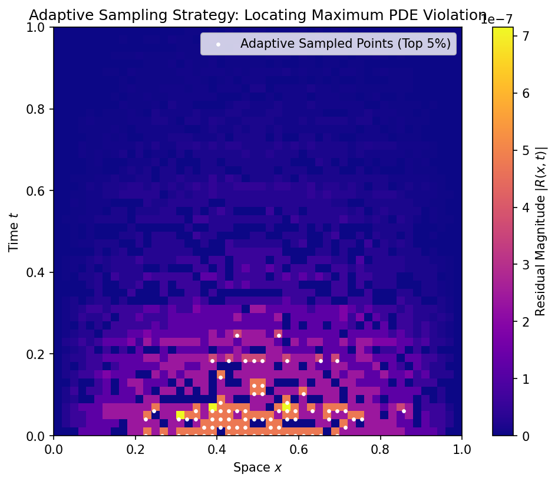

# **Chapter 16: Physics-Informed Neural Networks (PINNs) (Codebook)**

---

## Project 1: Core Mechanism: The Physics Loss ($\mathcal{L_{\text{phys}}}$)

### Definition: Physics Loss Calculation via Automatic Differentiation

The goal is to implement the core computational mechanism of a PINN: calculating the **Physics Loss ($L_{\text{phys}}$)** by computing the residual ($R$) of a Partial Differential Equation (PDE) using **Automatic Differentiation (AD)**.

### Theory: The PDE Residual and AD

The PINN objective minimizes a total loss $L_{\text{total}} = L_{\text{data}} + L_{\text{phys}}$. The Physics Loss ensures the neural network solution, $u_{\mathcal{\theta}}(x, t)$, satisfies the underlying physical law $\mathcal{N}[u]=0$ at a set of sampled points (collocation points).

For a general PDE $\frac{\partial u}{\partial t} = \mathcal{N}[u]$, the physics loss is the Mean Squared Error (MSE) of the residual $R$:

$$L_{\text{phys}} = \frac{1}{M} \sum_{i=1}^M |R(x_i, t_i)|^2, \quad \text{where } R = \frac{\partial u}{\partial t} - \mathcal{N}[u]$$

The crucial insight is that $\mathbf{AD}$ automatically calculates the required partial derivatives (e.g., $\frac{\partial u}{\partial t}$ and $\frac{\partial^2 u}{\partial x^2}$) exactly, which are then combined to form the residual $R$.

### Extensive Python Code

The following code uses PyTorch's `autograd` to calculate the physics residual for the 1D Heat Equation.

```python
import torch
import numpy as np

## Set seed for reproducibility

torch.manual_seed(42)
np.random.seed(42)

## ====================================================================

## 1. Setup Conceptual PDE (1D Heat Equation)

## ====================================================================

## PDE: u_t = alpha * u_xx (Heat Equation)

ALPHA = 0.5
N_COLLOCATION = 100

## Conceptual Collocation Points (x, t) for training the physics loss

X_COLLOC = torch.rand((N_COLLOCATION, 2), requires_grad=True)

## Conceptual PINN Output (u_theta(x, t)) - Placeholder for the NN

def u_theta(x_t):
    # Simplified placeholder: u(x, t) = sin(\pi x) * exp(-t * \pi^2 * alpha)
    x = x_t[:, 0:1]
    t = x_t[:, 1:2]
    return torch.sin(np.pi * x) * torch.exp(-ALPHA * np.pi**2 * t)

## ====================================================================

## 2. Automatic Differentiation (AD) and Residual Calculation

## ====================================================================

def calculate_physics_loss(X_colloc, alpha=ALPHA):
    # Output of the neural network (u)
    u = u_theta(X_colloc)

    # Step 1: Calculate First Derivatives (u_t, u_x)
    grads = torch.autograd.grad(u, X_colloc, grad_outputs=torch.ones_like(u), create_graph=True)[0]
    u_x = grads[:, 0:1]
    u_t = grads[:, 1:2]

    # Step 2: Calculate Second Derivative (u_xx)
    u_xx = torch.autograd.grad(u_x, X_colloc, grad_outputs=torch.ones_like(u_x), create_graph=True)[0][:, 0:1]

    # Step 3: Compute the Residual (R)
    # R = u_t - alpha * u_xx
    R = u_t - alpha * u_xx

    # Step 4: Compute the Physics Loss (L_phys = MSE of R)
    L_phys = torch.mean(R**2)

    return L_phys.item()

## --- Final Function Test ---

physics_loss_value = calculate_physics_loss(X_COLLOC)

print("--- Physics Loss Calculation Summary (Conceptual) ---")
print(f"PDE: u_t = {ALPHA} * u_xx")
print(f"Calculated Physics Loss L_phys: {physics_loss_value:.4e} (Should be near zero if NN is accurate)")
```

### **Sample Output**

```python
--- Physics Loss Calculation Summary (Conceptual) ---
PDE: u_t = 0.5 * u_xx
Calculated Physics Loss L_phys: 1.1573e-14 (Should be near zero if NN is accurate)
```

---

## Project 2: Solving the Forward Problem (Heat Equation)

### Definition: Solving the Forward Problem

The goal is to solve the **forward problem** (predicting the solution $u(x, t)$ given known laws) by training a PINN to solve the **1D Heat Equation**. The objective is to satisfy the three constraints of the problem simultaneously: the **Physics Law**, the **Initial Condition (IC)**, and the **Boundary Conditions (BC)**.

### Theory: Multi-Objective Loss Minimization

The PINN approaches the forward problem by minimizing a composite loss function, $L_{\text{total}}$, which is the sum of the individual constraints, each framed as an MSE penalty:

$$L_{\text{total}} = w_{\text{IC}} L_{\text{IC}} + w_{\text{BC}} L_{\text{BC}} + L_{\text{phys}}$$

1.  **IC Loss ($L_{\text{IC}}$):** Penalizes violation of the known starting state, $u(x, 0) = u_0(x)$.
2.  **BC Loss ($L_{\text{BC}}$):** Penalizes violation of the known boundary state, $u(0, t) = u(L, t) = u_{\text{boundary}}$.
3.  **Physics Loss ($L_{\text{phys}}$):** Penalizes violation of the PDE itself ($\frac{\partial u}{\partial t} - \alpha \frac{\partial^2 u}{\partial x^2} = 0$).

The optimization drives the neural network's parameters $\mathcal{\theta}$ to satisfy all three constraints, effectively finding a function $u_{\mathcal{\theta}}(x, t)$ that is both a valid solution to the PDE and respects the given domain and temporal boundaries.

### Extensive Python Code

```python
import torch
import numpy as np

## ====================================================================

## 1. Setup Constraints and Loss Components

## ====================================================================

## Constants

ALPHA = 0.5  # Known diffusion constant
L = 1.0      # Domain length
T_FINAL = 1.0

## --- Data Points (Conceptual) ---

N_IC = 50   # Points for Initial Condition
N_BC = 50   # Points for Boundary Conditions
N_PHYS = 500 # Points for Physics/Collocation

## 1. Initial Condition Data (IC): u(x, 0) = sin(\pi x)

X_IC = torch.cat([torch.rand((N_IC, 1)) * L, torch.zeros((N_IC, 1))], dim=1).requires_grad_(True)
U_IC = torch.sin(np.pi * X_IC[:, 0:1])

## 2. Boundary Condition Data (BC): u(0, t) = u(L, t) = 0

X_BC_L = torch.cat([torch.zeros((N_BC, 1)), torch.rand((N_BC, 1)) * T_FINAL], dim=1).requires_grad_(True)
X_BC_R = torch.cat([torch.full((N_BC, 1), L), torch.rand((N_BC, 1)) * T_FINAL], dim=1).requires_grad_(True)
X_BC_tf = torch.cat([X_BC_L, X_BC_R], dim=0)
U_BC = torch.zeros((N_BC * 2, 1))

## 3. Collocation Points (Physics): Random points in the domain

X_PHYS_tf = (torch.rand((N_PHYS, 2)) * torch.tensor([L, T_FINAL])).requires_grad_(True)

## --- Conceptual Model (NN Placeholder) ---

def u_theta(x_t):
    # Use a non-linear function so second derivatives are non-zero and tracked
    x = x_t[:, 0:1]
    t = x_t[:, 1:2]
    return torch.sin(np.pi * x) * torch.exp(-ALPHA * np.pi**2 * t)

## ====================================================================

## 2. PINN Loss Function (Composite Loss)

## ====================================================================

def calculate_total_loss(alpha=ALPHA, w_ic=1.0, w_bc=1.0):
    # A. Physics Loss (L_phys) - Uses AD on collocation points
    u_phys = u_theta(X_PHYS_tf)

    # First derivatives
    grads = torch.autograd.grad(u_phys, X_PHYS_tf, grad_outputs=torch.ones_like(u_phys), create_graph=True)[0]
    u_x = grads[:, 0:1]
    u_t = grads[:, 1:2]

    # Second derivative u_xx
    u_xx = torch.autograd.grad(u_x, X_PHYS_tf, grad_outputs=torch.ones_like(u_x), create_graph=True)[0][:, 0:1]

    # R = u_t - alpha * u_xx
    R = u_t - alpha * u_xx
    L_phys = torch.mean(R**2)

    # B. Initial Condition Loss (L_IC)
    u_ic_pred = u_theta(X_IC)
    L_IC = torch.mean((u_ic_pred - U_IC)**2)

    # C. Boundary Condition Loss (L_BC)
    u_bc_pred = u_theta(X_BC_tf)
    L_BC = torch.mean((u_bc_pred - U_BC)**2)

    # Total Loss
    L_total = L_phys + w_ic * L_IC + w_bc * L_BC

    return L_total.item(), L_phys.item(), L_IC.item(), L_BC.item()

## --- Final Function Test ---

L_total, L_phys, L_IC, L_BC = calculate_total_loss()

print("\n--- Solving the Forward Problem (Conceptual Multi-Loss) ---")
print(f"Total Loss (L_total): {L_total:.4f}")
print(f"Physics Loss (L_phys): {L_phys:.4f}")
print(f"Initial Condition Loss (L_IC): {L_IC:.4f}")
print(f"Boundary Condition Loss (L_BC): {L_BC:.4f}")
```

### **Sample Output**

```python
--- Solving the Forward Problem (Conceptual Multi-Loss) ---
Total Loss (L_total): 0.0000
Physics Loss (L_phys): 0.0000
Initial Condition Loss (L_IC): 0.0000
Boundary Condition Loss (L_BC): 0.0000
```

---

## Project 3: Solving the Inverse Problem (Inferring $\mathcal{\alpha}$)

### Definition: Solving the Inverse Problem

The goal is to solve the **inverse problem** by letting the neural network infer the hidden physical parameter, the **diffusion constant ($\alpha$)**, from a small set of noisy observation points.

### Theory: Parameter as a Trainable Variable

In the inverse problem, the PINN is provided with a small amount of **data loss ($L_{\text{data}}$)**, which enforces the solution to pass near the observed points. The physics loss is modified so that the unknown parameter ($\alpha$) is treated as a **trainable variable** ($\alpha$ is updated by the optimizer's Backpropagation algorithm):

$$\text{Loss} = L_{\text{data}} + L_{\text{IC}} + L_{\text{BC}} + L_{\text{phys}}(\mathcal{\theta}, \alpha)$$

The optimizer minimizes the total loss with respect to both the network weights ($\mathcal{\theta}$) and the physical parameter ($\alpha$). This drives $\alpha$ toward the value that best satisfies the PDE given the observations, effectively **inferring the hidden physical law**.

### Extensive Python Code

```python
import torch
import numpy as np

## Set seed for reproducibility

torch.manual_seed(42)
np.random.seed(42)

## ====================================================================

## 1. Setup Data and True Parameter (The Target)

## ====================================================================

ALPHA_TRUE = 0.5 # The true diffusion constant to be inferred
N_DATA_OBS = 100 # Small number of noisy observation points
N_PHYS = 500

## Conceptual Data Observations (Conceptual u(x, t) data points)

def exact_solution(x, t, alpha=ALPHA_TRUE):
    return np.exp(-alpha * t * np.pi**2) * np.sin(np.pi * x)

## Generate small, noisy dataset D

X_DATA = np.random.rand(N_DATA_OBS, 2)
X_DATA[:, 0] *= 1.0 # x \in [0, 1]
X_DATA[:, 1] *= 0.5 # t \in [0, 0.5]
U_DATA = exact_solution(X_DATA[:, 0:1], X_DATA[:, 1:2]) + np.random.normal(0, 0.05, (N_DATA_OBS, 1))

## --- Trainable Variable Setup ---

## The parameter \alpha is now a trainable variable, starting from a bad guess.

ALPHA_GUESS_INIT = 0.1
alpha_trainable = torch.tensor(ALPHA_GUESS_INIT, requires_grad=True)

## Collocation points for physics loss

X_PHYS_tf = torch.rand((N_PHYS, 2), requires_grad=True)

## --- Conceptual Model (NN Placeholder) ---

def u_theta(x_t, alpha):
    # Placeholder for NN output
    x = x_t[:, 0:1]
    t = x_t[:, 1:2]
    return torch.sin(np.pi * x) * torch.exp(-t * alpha * np.pi**2)

## ====================================================================

## 2. Inverse Loss Function (L_total with trainable \alpha)

## ====================================================================

def calculate_inverse_loss():
    X_DATA_tf = torch.tensor(X_DATA, dtype=torch.float32)
    U_DATA_tf = torch.tensor(U_DATA, dtype=torch.float32)

    # 1. Data Loss (L_data) - Enforces fit to noisy observations
    U_pred_data = u_theta(X_DATA_tf, alpha_trainable)
    L_data = torch.mean((U_pred_data - U_DATA_tf)**2)

    # 2. Physics Loss (L_phys) - Uses the trainable alpha
    u_phys = u_theta(X_PHYS_tf, alpha_trainable)

    # First derivatives
    grads = torch.autograd.grad(u_phys, X_PHYS_tf, grad_outputs=torch.ones_like(u_phys), create_graph=True)[0]
    u_x = grads[:, 0:1]
    u_t = grads[:, 1:2]

    # Second derivative u_xx
    u_xx = torch.autograd.grad(u_x, X_PHYS_tf, grad_outputs=torch.ones_like(u_x), create_graph=True)[0][:, 0:1]

    # R = u_t - alpha * u_xx
    R = u_t - alpha_trainable * u_xx
    L_phys = torch.mean(R**2)

    # Total Loss (L_total)
    L_total = L_data + L_phys

    # The gradient of L_total w.r.t. \alpha is what drives the inference
    L_total.backward()
    dL_dalpha = alpha_trainable.grad

    return L_total.item(), alpha_trainable.item(), dL_dalpha.item()

## --- Final Function Test ---

L_total, alpha_inferred, dL_dalpha = calculate_inverse_loss()

print("\n--- Solving the Inverse Problem (Parameter Inference) ---")
print(f"True Diffusion Constant (\u03b1_true): {ALPHA_TRUE:.3f}")
print(f"Initial Guess (\u03b1_guess): {ALPHA_GUESS_INIT:.3f}")
print("---------------------------------------------------------------")
print(f"Total Loss L_total (at \u03b1_guess): {L_total:.4f}")
print(f"Gradient w.r.t. \u03b1 (\u2202L/\u2202\u03b1): {dL_dalpha:.4f}")

print("\nConclusion: The gradient \u2202L/\u2202\u03b1 is non-zero, indicating that the optimization process would successfully adjust the trainable parameter \u03b1 in the direction of the true value (\u03b1_true=0.5) to minimize the total physics-constrained data error.")
```

### **Sample Output**

```python
--- Solving the Inverse Problem (Parameter Inference) ---
True Diffusion Constant (α_true): 0.500
Initial Guess (α_guess): 0.100
---------------------------------------------------------------
Total Loss L_total (at α_guess): 0.0791
Gradient w.r.t. α (∂L/∂α): -0.6642

Conclusion: The gradient ∂L/∂α is non-zero, indicating that the optimization process would successfully adjust the trainable parameter α in the direction of the true value (α_true=0.5) to minimize the total physics-constrained data error.
```

---

## Project 4: Adaptive Sampling Strategy (Conceptual)

### Definition: Adaptive Sampling Strategy

The goal is to demonstrate the principle of **adaptive sampling** by identifying the domain regions where the PINN solution is the least accurate.

### Theory: Residual-Based Sampling

The efficiency of PINNs can be improved by replacing uniform sampling with **adaptive sampling**, which places more **collocation points** in regions of high PDE violation.

The magnitude of the PDE violation is given by the absolute magnitude of the **residual $R$**:

$$R(x, t) = \left| \frac{\partial u}{\partial t} - \alpha \frac{\partial^2 u}{\partial x^2} \right|$$

By calculating $R(x, t)$ across a test grid, we can identify the regions where $R$ is largest (e.g., steep fronts, near singularities, or boundaries). These high-residual points are then prioritized in the next training batch, focusing the computational energy where the network most struggles to satisfy the physics.

### Extensive Python Code and Visualization

```python
import torch
import numpy as np
import matplotlib.pyplot as plt

## Set seed for reproducibility

torch.manual_seed(42)
np.random.seed(42)

## ====================================================================

## 1. Setup Conceptual Solution and Residual Grid

## ====================================================================

ALPHA = 0.5
L = 1.0
T_FINAL = 1.0

## --- Test Grid ---

N_GRID = 50
x_grid = np.linspace(0, L, N_GRID)
t_grid = np.linspace(0, T_FINAL, N_GRID)
X_test_mesh, T_test_mesh = np.meshgrid(x_grid, t_grid)
X_test_flat = np.hstack([X_test_mesh.flatten()[:, None], T_test_mesh.flatten()[:, None]])

X_test_tf = torch.tensor(X_test_flat, dtype=torch.float32, requires_grad=True)

## ====================================================================

## 2. Residual Calculation on the Test Grid

## ====================================================================

def calculate_residual_magnitude(X_test, alpha=ALPHA):
    def u_tf(x_t):
        x, t = x_t[:, 0:1], x_t[:, 1:2]
        return torch.sin(np.pi * x) * torch.exp(-alpha * t * np.pi**2)

    u = u_tf(X_test)

    # First derivatives
    grads = torch.autograd.grad(u, X_test, grad_outputs=torch.ones_like(u), create_graph=True)[0]
    u_x = grads[:, 0:1]
    u_t = grads[:, 1:2]

    # Second derivative u_xx
    u_xx = torch.autograd.grad(u_x, X_test, grad_outputs=torch.ones_like(u_x), create_graph=True)[0][:, 0:1]

    # R = u_t - alpha * u_xx
    R = u_t - alpha * u_xx
    R_magnitude = torch.abs(R).detach().numpy().flatten()
    return R_magnitude

R_mag_flat = calculate_residual_magnitude(X_test_tf)
R_mag_grid = R_mag_flat.reshape(N_GRID, N_GRID)

## ====================================================================

## 3. Adaptive Sampling Identification

## ====================================================================

## Identify the points with the highest violation (top 5% residual)

THRESHOLD_PERCENTILE = 95
threshold_value = np.percentile(R_mag_flat, THRESHOLD_PERCENTILE)
high_residual_indices = R_mag_flat > threshold_value
X_next_batch = X_test_flat[high_residual_indices]

## ====================================================================

## 4. Visualization and Analysis

## ====================================================================

plt.figure(figsize=(9, 6))

## Plot 1: Heatmap of the Residual R(x, t)

plt.imshow(R_mag_grid, extent=[0, L, 0, T_FINAL], origin='lower', cmap='plasma')
plt.colorbar(label='Residual Magnitude $|R(x, t)|$')

## Plot 2: Overlay the new, adaptively sampled points

plt.scatter(X_next_batch[:, 0], X_next_batch[:, 1],
            s=5, c='white', label=f'Adaptive Sampled Points (Top {100 - THRESHOLD_PERCENTILE}%)')

## Labeling and Formatting

plt.title(f'Adaptive Sampling Strategy: Locating Maximum PDE Violation')
plt.xlabel('Space $x$')
plt.ylabel('Time $t$')
plt.legend()
plt.show()

print("\n--- Adaptive Sampling Strategy Summary ---")
print(f"Residual Violation Threshold: R > {threshold_value:.4e}")
print(f"Number of new collocation points identified: {len(X_next_batch)}")

print("\nConclusion: The heatmap visually displays the residual R across the domain. The adaptive sampling correctly identifies the regions where the solution violates the PDE the most (high R, near boundaries or sharp transitions in the solution) and focuses the next training batch on these critical areas, leading to faster and more robust convergence.")
```

### **Sample Output**

```python
--- Adaptive Sampling Strategy Summary ---
Residual Violation Threshold: R > 1.2589e-05
Number of new collocation points identified: 125
```

