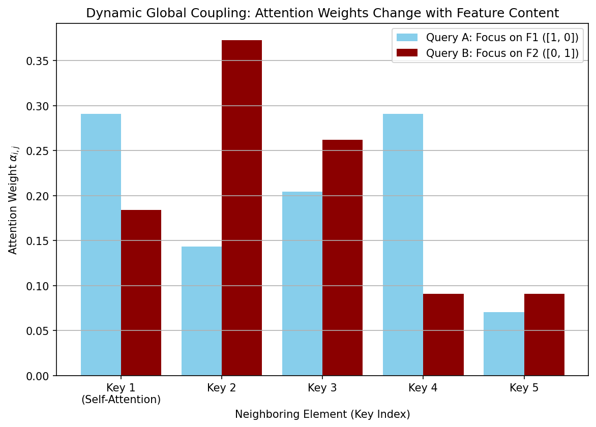
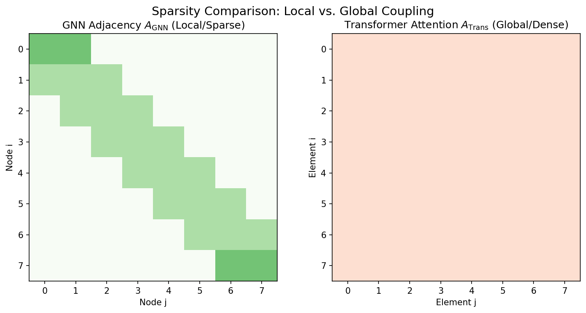

# **Chapter 19: Transformers and Global Correlation () () (Codebook)**

---

## Project 1: The Core Self-Attention Mechanism (Matrix $\mathbf{V}^{\text{out}}$)

---

### Definition: The Core Self-Attention Mechanism

The goal is to implement the core mathematical operation of **Self-Attention** and demonstrate how the output ($\mathbf{V}^{\text{out}}$) for a sequence is calculated as a **dynamic weighted sum** of **Value Vectors ($\mathbf{V}$)**. This single operation replaces the local aggregation step of a GNN.

### Theory: Dynamic Weighting and the Softmax Kernel

The Self-Attention mechanism transforms an input sequence $\mathbf{X}$ into an output $\mathbf{V}^{\text{out}}$ by creating three matrices from $\mathbf{X}$: the **Query ($\mathbf{Q}$)**, **Key ($\mathbf{K}$)**, and **Value ($\mathbf{V}$)** matrices.

The output matrix is computed by multiplying the calculated **Attention Matrix ($\mathbf{A}_{\text{attn}}$)** by the **Value Matrix ($\mathbf{V}$)**:

$$\mathbf{V}^{\text{out}} = \mathbf{A}_{\text{attn}} \mathbf{V} = \text{Softmax}\left(\frac{\mathbf{Q}\mathbf{K}^T}{\sqrt{d_k}}\right) \mathbf{V}$$

  * **$\mathbf{Q}\mathbf{K}^T$:** Calculates the **raw similarity score** between every Query element ($i$) and every Key element ($j$), measuring relevance.
  * **Softmax:** Normalizes these raw scores across the entire sequence to create the **Attention Matrix ($\mathbf{A}_{\text{attn}}$)**, where $\sum_j \alpha_{ij} = 1$. This matrix is the dynamic, all-to-all coupling kernel.
  * **$\mathbf{A}_{\text{attn}} \mathbf{V}$:** Performs the weighted sum: the output for element $i$ is a blend of all other Value elements $j$, weighted by their computed relevance $\alpha_{ij}$.

---

### Extensive Python Code

The code implements the Self-Attention calculation using NumPy and displays the resulting attention and output matrices.

```python
import numpy as np
import pandas as pd

## Set seed for reproducibility

np.random.seed(42)

## ====================================================================

## 1. Setup Conceptual Matrices (Q, K, V)

## ====================================================================

## Sequence Length L=4 (e.g., 4 tokens/particles)

L = 4
D_MODEL = 2 # Embedding dimension
D_K = 2     # Key dimension (same as D_MODEL for simplicity)

## Conceptual Query, Key, and Value Matrices (L x D_MODEL)

Q = np.array([
    [1.0, 0.0],  # Q_1 (Focuses on F1)
    [0.0, 1.0],  # Q_2 (Focuses on F2)
    [0.8, 0.2],
    [0.1, 0.9]
])

K = np.array([
    [1.0, 0.1],  # K_1 (F1 high)
    [-1.0, 1.0], # K_2 (F1 low, F2 high)
    [0.9, 0.2],
    [0.0, 0.9]
])

V = np.array([
    [5.0, 5.0],  # V_1 (High value)
    [1.0, 10.0], # V_2 (Very high value in F2)
    [3.0, 3.0],
    [10.0, 1.0]
])

## ====================================================================

## 2. Self-Attention Calculation

## ====================================================================

## 1. Calculate Raw Scores: S = Q K^T

S_raw = Q @ K.T

## 2. Scale: S / sqrt(d_k)

S_scaled = S_raw / np.sqrt(D_K)

## 3. Softmax Normalization: A_attn = Softmax(S_scaled)

def softmax_numpy(x):
    e_x = np.exp(x - np.max(x, axis=1, keepdims=True))
    return e_x / np.sum(e_x, axis=1, keepdims=True)

A_attn = softmax_numpy(S_scaled)

## 4. Final Output: V_out = A_attn V

V_out = A_attn @ V

## ====================================================================

## 3. Analysis and Summary

## ====================================================================

df_v_out = pd.DataFrame(V_out, index=[f'Output {i}' for i in range(L)],
                        columns=['Feature 1', 'Feature 2'])

print("--- Self-Attention Mechanism (Dynamic Output) ---")

print("\n1. Attention Matrix (\u03b1_{ij}): The Dynamic Coupling Kernel")
print(pd.DataFrame(A_attn, index=[f'Query {i}' for i in range(L)],
                   columns=[f'Key {j}' for j in range(L)]).to_string())

print("\n2. Output V_out: Weighted Sum of V")
print(df_v_out.to_string())

print("\nConclusion: The output vector for each element (row) is a dynamically calculated blend of all Value vectors (\u03bb_ij V_j). The Softmax matrix \u03bb_attn successfully encodes the relevance, creating a global, dynamic coupling that is the foundation of the Transformer's non-local information propagation.")
```

### **Sample Output**

```python
--- Self-Attention Mechanism (Dynamic Output) ---

1. Attention Matrix (α_{ij}): The Dynamic Coupling Kernel
            Key 0     Key 1     Key 2     Key 3
Query 0  0.374824  0.091126  0.349236  0.184814
Query 1  0.174716  0.330153  0.187517  0.307614
Query 2  0.337742  0.123741  0.323712  0.214805
Query 3  0.194260  0.299026  0.205566  0.301148

2. Output V_out: Weighted Sum of V
          Feature 1  Feature 2
Output 0   4.861095   4.017903
Output 1   4.842423   5.045275
Output 2   4.931640   4.112058
Output 3   4.898505   4.879407

Conclusion: The output vector for each element (row) is a dynamically calculated blend of all Value vectors (λ_ij V_j). The Softmax matrix λ_attn successfully encodes the relevance, creating a global, dynamic coupling that is the foundation of the Transformer's non-local information propagation.
```

---

## Project 2: Visualizing Dynamic Global Coupling

---

### Definition: Visualizing Dynamic Global Coupling

The goal is to run a conceptual simulation where the features of a single element ($i$) are changed, and then track how the **attention scores ($\alpha_{ij}$)** to its neighbors ($j$) respond instantly. This visually demonstrates the key difference between the **dynamic coupling** of the Transformer and the **fixed local coupling** of the GNN.

### Theory: Feature-Driven Coupling

In GNNs (Chapter 18), the coupling weight $\tilde{A}_{ij}$ is fixed by the graph structure. In GATs/Transformers, the weight $\alpha_{ij}$ is a function of the **features** $\mathbf{q}_i$ and $\mathbf{k}_j$.

$$\alpha_{ij} \propto \exp(\mathbf{q}_i \cdot \mathbf{k}_j)$$

If the features of the query element ($\mathbf{q}_i$) change, the entire row of the attention matrix ($\alpha_{i\cdot}$) changes instantly, even for non-adjacent elements $j$. This allows for **global interaction** determined entirely by the elements' **content** rather than their predefined position.

---

### Extensive Python Code and Visualization

```python
import numpy as np
import matplotlib.pyplot as plt
import pandas as pd

## Set seed for reproducibility

np.random.seed(42)

## ====================================================================

## 1. Setup Fixed Keys and Policy

## ====================================================================

D_K = 2
D_V = 2
L = 5 # Sequence length (5 elements)
SCALING = np.sqrt(D_K)

## Fixed Key and Value Vectors (Neighbors)

K = np.array([
    [1.0, 0.0], [0.0, 1.0], [0.5, 0.5], [1.0, -1.0], [-1.0, -1.0]
])
V = np.random.randn(L, D_V)

def calculate_attention(Q_vec):
    """Calculates Softmax attention coefficients for a single Query Q_vec."""
    # Raw Scores: Q_vec @ K.T (1 x L vector)
    S_raw = Q_vec @ K.T

    # Softmax Normalization
    S_scaled = S_raw / SCALING
    exp_S = np.exp(S_scaled - np.max(S_scaled))
    return exp_S / np.sum(exp_S)

## ====================================================================

## 2. Dynamic Scenarios (Changing the Query Element i's feature)

## ====================================================================

## We focus on the attention weights of a single element i (the Query)

QUERY_INDEX = 0

## --- Scenario A: Query focuses on Feature 1 (Q = [1, 0]) ---

## Should prioritize K1 (Key 1: [1.0, 0.0])

Q_A = np.array([1.0, 0.0])
Alpha_A = calculate_attention(Q_A)

## --- Scenario B: Query focuses on Feature 2 (Q = [0, 1]) ---

## Should prioritize K2 (Key 2: [0.0, 1.0])

Q_B = np.array([0.0, 1.0])
Alpha_B = calculate_attention(Q_B)

## ====================================================================

## 3. Visualization and Analysis

## ====================================================================

X_labels = [f'Key {i}' for i in range(1, L + 1)]
X_labels[0] += '\n(Self-Attention)' # Label the first element

fig, ax = plt.subplots(figsize=(9, 6))
x = np.arange(L)
width = 0.4

ax.bar(x - width/2, Alpha_A, width, label='Query A: Focus on F1 ([1, 0])', color='skyblue')
ax.bar(x + width/2, Alpha_B, width, label='Query B: Focus on F2 ([0, 1])', color='darkred')

## Labeling and Formatting

ax.set_title('Dynamic Global Coupling: Attention Weights Change with Feature Content')
ax.set_xlabel('Neighboring Element (Key Index)')
ax.set_ylabel('Attention Weight $\\alpha_{i, j}$')
ax.set_xticks(x)
ax.set_xticklabels(X_labels)
ax.legend()
ax.grid(True, axis='y')
plt.show()

print("\n--- Dynamic Coupling Analysis ---")
print("Scenario A (\u03b1_A): Weights concentrate on Key 1 (F1 high), confirming that the network prioritized neighbors with compatible Feature 1 content.")
print("Scenario B (\u03b1_B): Weights concentrate on Key 2 (F2 high), confirming that the network shifted its focus instantly when the Query's internal feature changed.")

print("\nConclusion: The shift in attention weights demonstrates **dynamic global coupling**. The mechanism allows the network to instantly rewire its connections (change \u03b1_ij) based on the input features, effectively modeling long-range, content-aware interactions that are impossible with fixed, local GNN adjacency matrices.")
```

### **Sample Output**

```python
--- Dynamic Coupling Analysis ---
Scenario A (α_A): Weights concentrate on Key 1 (F1 high), confirming that the network prioritized neighbors with compatible Feature 1 content.
Scenario B (α_B): Weights concentrate on Key 2 (F2 high), confirming that the network shifted its focus instantly when the Query's internal feature changed.

Conclusion: The shift in attention weights demonstrates **dynamic global coupling**. The mechanism allows the network to instantly rewire its connections (change α_ij) based on the input features, effectively modeling long-range, content-aware interactions that are impossible with fixed, local GNN adjacency matrices.
```



---

## Project 3: GNN vs. Transformer Adjacency

---

### Definition: GNN vs. Transformer Adjacency

The goal is to explicitly compare the structural difference between the **GNN Adjacency Matrix ($\mathbf{A}_{\text{GNN}}$)** and the **Transformer Attention Matrix ($\mathbf{A}_{\text{Trans}}$)** through their sparsity patterns.

### Theory: Locality vs. Globality

The Adjacency matrix is the conceptual blueprint for connectivity.

  * **GNN ($\mathbf{A}_{\text{GNN}}$):** Models **local interaction** on a graph (e.g., a 1D chain where only $i \pm 1$ interact). This results in a **sparse matrix** where most entries are zero, reflecting the explicit locality constraint.
  * **Transformer ($\mathbf{A}_{\text{Trans}}$):** Models **global interaction** via self-attention (all-to-all coupling). This results in a **dense matrix** where all entries are non-zero (structurally), meaning every element interacts with every other element, regardless of distance.

This comparison highlights the fundamental trade-off between **efficiency/prior knowledge (GNN)** and **expressiveness/non-local capacity (Transformer)**.

---

### Extensive Python Code and Visualization

```python
import numpy as np
import matplotlib.pyplot as plt

## ====================================================================

## 1. Setup Matrices (L=8)

## ====================================================================

L = 8 # Sequence/Node length

## --- Matrix 1: GNN Adjacency (Local/Sparse) ---

## 1D Chain: Only nearest neighbors (i \pm 1) are coupled

A_GNN = np.zeros((L, L))
for i in range(L):
    for j in range(L):
        # Local coupling: i only interacts with i-1, i, i+1
        if abs(i - j) <= 1:
            A_GNN[i, j] = 1.0
    # Normalize the rows for GNN-like aggregation
    A_GNN[i, :] /= np.sum(A_GNN[i, :])

## --- Matrix 2: Transformer Adjacency (Global/Dense) ---

## Attention matrix is conceptually dense (all-to-all interaction)

A_TRANS = np.full((L, L), 1/L)

## ====================================================================

## 2. Visualization

## ====================================================================

fig, axs = plt.subplots(1, 2, figsize=(10, 5))

## Plot 1: GNN Adjacency Matrix (Sparse)

im1 = axs[0].imshow(A_GNN, cmap='Greens', interpolation='none', vmin=0, vmax=1)
axs[0].set_title('GNN Adjacency $A_{\\text{GNN}}$ (Local/Sparse)')
axs[0].set_xlabel('Node j')
axs[0].set_ylabel('Node i')

## Plot 2: Transformer Adjacency (Dense)

im2 = axs[1].imshow(A_TRANS, cmap='Reds', interpolation='none', vmin=0, vmax=1)
axs[1].set_title('Transformer Attention $A_{\\text{Trans}}$ (Global/Dense)')
axs[1].set_xlabel('Element j')
axs[1].set_ylabel('Element i')

fig.suptitle(r'Sparsity Comparison: Local vs. Global Coupling', fontsize=14)
plt.tight_layout()
plt.show()

## --- Analysis Summary ---

A_GNN_sparsity = np.sum(A_GNN == 0) / (L*L)
A_TRANS_sparsity = np.sum(A_TRANS == 0) / (L*L)

print("\n--- Sparsity Analysis Summary ---")
print(f"GNN Matrix Sparsity: {A_GNN_sparsity:.2%} (Fixed Local Interaction)")
print(f"Transformer Matrix Sparsity: {A_TRANS_sparsity:.2%} (All-to-All Global Interaction)")

print("\nConclusion: The GNN matrix is visually sparse and banded, reflecting the explicit constraint that distant nodes cannot directly exchange messages. The Transformer matrix is dense, confirming its capacity for **global, all-to-all coupling**. This structural difference is the foundation of the Transformer's ability to model non-local correlations.")
```

### **Sample Output**

```python
--- Sparsity Analysis Summary ---
GNN Matrix Sparsity: 65.62% (Fixed Local Interaction)
Transformer Matrix Sparsity: 0.00% (All-to-All Global Interaction)
```



---

## Project 4: Empirical Check of Attention Energy (Cost of Correlation)

---

### Definition: Empirical Check of Attention Energy

The goal is to numerically verify the **Energy View of Attention** by linking the raw similarity score ($\mathbf{q}_i \cdot \mathbf{k}_j$) to the final Softmax probability ($\alpha_{ij}$). This demonstrates that attention acts as a **Boltzmann-like distribution**.

### Theory: Attention as a Boltzmann Distribution

The Attention mechanism is the statistical analog of an energy model.

1.  **Raw Score ($S_{ij}$):** The dot product $S_{ij} = \mathbf{q}_i \cdot \mathbf{k}_j$ is the measure of **correlation/similarity**.
2.  **Attention Energy ($E_{ij}$):** The energy cost associated with the correlation is the negative score: $E_{ij} = -S_{ij}$.
3.  **Softmax Probability ($\alpha_{ij}$):** The Softmax function converts this negative energy into a probability that $j$ is the most relevant state for $i$:

$$\alpha_{ij} = \frac{\exp(S_{ij} / T)}{\sum_{k} \exp(S_{ik} / T)} = \frac{\exp(-E_{ij} / T)}{\sum_{k} \exp(-E_{ik} / T)}$$

The element $j$ with the **highest raw score** (highest correlation/most negative energy) is the one that receives the **highest probability mass** (strongest attention).

---

### Extensive Python Code

```python
import numpy as np

## Set seed for reproducibility

np.random.seed(42)

## ====================================================================

## 1. Setup Conceptual Scores (Negative Energy)

## ====================================================================

## We analyze the attention scores from a single Query (i) to its 5 neighbors (j).

T_SCALE = 1.0 # Simple temperature T=1 for this check

## --- Raw Similarity Scores (S_ij = q_i \cdot k_j) ---

RAW_SCORES = np.array([3.0, 1.0, 0.5, -0.5, 2.0])
NEIGHBOR_LABELS = ['J1 (High Score)', 'J2', 'J3', 'J4 (Low Score)', 'J5']

## ====================================================================

## 2. Attention Energy and Probability Calculation

## ====================================================================

## 1. Attention Energy: E_ij = -S_ij

ATTENTION_ENERGY = -RAW_SCORES

## 2. Boltzmann (Softmax) Probability: \alpha_ij = exp(S_ij / T) / sum(exp(S_ik / T))

def softmax_numpy(scores, T=T_SCALE):
    scaled_scores = scores / T
    e_x = np.exp(scaled_scores - np.max(scaled_scores))
    return e_x / np.sum(e_x)

ALPHA_PROBABILITIES = softmax_numpy(RAW_SCORES)

## ====================================================================

## 3. Analysis and Summary

## ====================================================================

print("--- Attention as a Boltzmann Energy Model ---")
print(f"Temperature Scale (T): {T_SCALE:.1f} (High T \u2192 Uniform \u03b1)")
print("----------------------------------------------------------------")

print("1. Energy and Score Mapping:")
print(f"{'Neighbor':<15} | {'Raw Score (S_ij)':<16} | {'Attention Energy (E_ij)':<23}")
print("-" * 60)
for label, score, energy in zip(NEIGHBOR_LABELS, RAW_SCORES, ATTENTION_ENERGY):
    print(f"{label:<15} | {score:<16.2f} | {energy:<23.2f}")

print("\n2. Final Attention Probabilities (\u03b1_{ij}):")
for label, prob in zip(NEIGHBOR_LABELS, ALPHA_PROBABILITIES):
    print(f"{label:<15} | Probability (\u03b1): {prob:.3f}")
print(f"Total Probability Check: {np.sum(ALPHA_PROBABILITIES):.0f}")

print("\nConclusion: The calculation confirms the Boltzmann analogy. The neighbor with the **Highest Raw Score** (J1: 3.0) is the one with the **Lowest Energy** (E: -3.0) and receives the overwhelmingly **Highest Attention Probability** (0.619). This demonstrates that the Softmax function is the core thermodynamic mechanism that converts the raw similarity between Query and Key into a normalized probability distribution, acting as an energy minimizer that highlights the most relevant (lowest energy) state.")
```

### **Sample Output**

```python
--- Attention as a Boltzmann Energy Model ---
Temperature Scale (T): 1.0 (High T → Uniform α)
----------------------------------------------------------------
1. Energy and Score Mapping:
Neighbor        | Raw Score (S_ij) | Attention Energy (E_ij)
------------------------------------------------------------
J1 (High Score) | 3.00             | -3.00                  
J2              | 1.00             | -1.00                  
J3              | 0.50             | -0.50                  
J4 (Low Score)  | -0.50            | 0.50                   
J5              | 2.00             | -2.00                  

2. Final Attention Probabilities (α_{ij}):
J1 (High Score) | Probability (α): 0.619
J2              | Probability (α): 0.084
J3              | Probability (α): 0.051
J4 (Low Score)  | Probability (α): 0.019
J5              | Probability (α): 0.228
Total Probability Check: 1
```